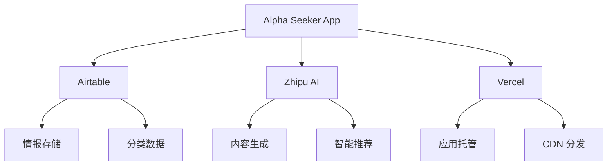

# 外部服务依赖 (External Services)

## 概述

Alpha Seeker 项目依赖的核心外部服务说明，包括服务用途、集成方式和配置要求。

## 核心服务

### Airtable - 数据存储服务
**服务类型**: 数据库即服务 (DBaaS)  
**用途**: 存储应用的核心数据，包括情报内容、分类体系、用户互动等  
**官方文档**: https://airtable.com/developers/web/api/introduction

#### 服务特性
- **数据模型**: 基于表格的关联数据模型
- **API 限制**: 
  - 每秒 5 次请求 (免费版)
  - 每月 1,200 条记录 (免费版)
  - 单次查询最多 100 条记录
- **数据同步**: 实时同步，无缓存延迟
- **备份**: 自动备份，支持版本回滚

#### 集成配置
```typescript
// .env.local - 环境变量配置
NEXT_PUBLIC_AIRTABLE_BASE_ID=appxxxxxxxxxx   # 基础应用ID
NEXT_PUBLIC_AIRTABLE_PERSONAL_ACCESS_TOKEN=patxxxxxxxxxx  # 个人访问令牌
```

#### 故障处理
```typescript
// src/utils/airtable-error-handler.ts
export class AirtableErrorHandler {
  static handle(error: any) {
    console.error('Airtable API 错误:', error)
    
    switch (error.error) {
      case 'NOT_AUTHORIZED':
        throw new Error('Airtable API 密钥无效')
      case 'NOT_FOUND':
        throw new Error('Airtable 基础应用或表格不存在')
      case 'REQUEST_TIMEOUT':
        throw new Error('请求超时，请稍后重试')
      case 'RATE_LIMIT_EXCEEDED':
        // 实现指数退避重试
        return this.retryWithBackoff(() => {
          // 重试原请求
        })
      default:
        throw new Error('Airtable 服务暂时不可用')
    }
  }
  
  private static async retryWithBackoff(
    fn: () => Promise<any>,
    maxRetries = 3,
    delay = 1000
  ) {
    for (let i = 0; i < maxRetries; i++) {
      try {
        return await fn()
      } catch (error) {
        if (i === maxRetries - 1) throw error
        await new Promise(resolve => setTimeout(resolve, delay * Math.pow(2, i)))
      }
    }
  }
}
```

### Zhipu AI - 智谱AI服务
**服务类型**: AI 大模型服务  
**用途**: 内容生成、智能推荐、文本处理  
**官方文档**: https://open.bigmodel.cn/dev/api#overview

#### 服务特性
- **可用模型**: 
  - GLM-4: 通用大模型，支持长文本
  - GLM-4-Air: 轻量级模型，响应快速
  - GLM-4V: 多模态模型，支持图像理解
- **API 限制**: 根据套餐不同
- **计费方式**: 按 token 使用量计费

#### 集成配置
```typescript
// .env.local
ZHIPUAI_API_KEY=xxxxxxxxxx  # 智谱AI API密钥
ZHIPUAI_BASE_URL=https://open.bigmodel.cn/api/paas/v4

# 模型配置
ZHIPUAI_MODEL_DEFAULT=glm-4
ZHIPUAI_MODEL_FAST=glm-4-air
ZHIPUAI_MAX_TOKENS=4000
ZHIPUAI_TEMPERATURE=0.7
```

#### 错误处理和降级
```typescript
// src/utils/ai-error-handler.ts
export class AIErrorHandler {
  static async withFallback<T>(
    aiCall: () => Promise<T>,
    fallbackValue: T
  ): Promise<T> {
    try {
      return await aiCall()
    } catch (error) {
      console.warn('AI 服务调用失败，使用降级方案:', error)
      return fallbackValue
    }
  }

  static handleRateLimit() {
    // 返回缓存结果或默认值
    return {
      summary: '内容摘要生成中...',
      recommendations: [],
      qualityScore: 5,
    }
  }
}
```

## 部署服务

### Vercel - 部署平台
**服务类型**: Serverless 部署平台  
**用途**: 应用托管、自动部署、CDN 加速  
**官方文档**: https://vercel.com/docs

#### 服务特性
- **部署方式**: Git 集成，自动部署
- **边缘函数**: 全球边缘网络
- **环境变量**: 支持多环境配置
- **限制**:
  - 免费版：100GB 带宽/月
  - 函数执行：10秒超时
  - 存储空间：100GB

#### 配置文件
```json
// vercel.json
{
  "version": 2,
  "builds": [
    {
      "src": "package.json",
      "use": "@vercel/next"
    }
  ],
  "env": {
    "NEXT_PUBLIC_API_URL": "https://alpha-seeker.vercel.app/api"
  }
}
```

## 服务依赖图



## 故障恢复策略

### Airtable 故障
- **降级方案**: 使用本地缓存数据
- **恢复策略**: 自动重试机制
- **数据备份**: 定期导出数据备份

### Zhipu AI 故障
- **降级方案**: 
  - 返回默认推荐
  - 使用简单文本处理
  - 显示"AI 服务暂时不可用"
- **恢复策略**: 指数退避重试

### Vercel 故障
- **降级方案**: 静态页面渲染
- **恢复策略**: 自动回滚到上一个稳定版本

## 服务等级协议 (SLA)

| 服务 | 可用性 | 响应时间 | 故障恢复 |
|------|--------|----------|----------|
| Airtable | 99.9% | <500ms | 自动恢复 |
| Zhipu AI | 99.5% | <2s | 降级服务 |
| Vercel | 99.99% | <100ms | 自动恢复 |

## 成本控制

### Airtable
- 免费版：1,200 记录/月
- 升级方案：$20/月（5,000 记录）

### Zhipu AI
- 免费额度：根据活动调整
- 预估成本：$10-50/月（根据用量）

### Vercel
- 免费版：100GB 带宽/月
- 升级方案：$20/月（1TB 带宽）

## 安全考虑

### API 密钥管理
- 使用环境变量存储
- 定期轮换密钥
- 限制 API 权限范围

### 数据传输安全
- 所有 API 调用使用 HTTPS
- 敏感数据加密存储
- 实施请求签名验证

### 访问控制
- 实施 IP 白名单
- 限制 API 调用频率
- 监控异常访问模式