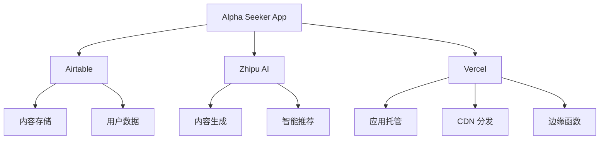

# 外部服务依赖 (External Services)

## 概述
Alpha Seeker 项目依赖的外部服务说明，包括服务用途、集成方式、配置要求和故障处理策略。

## 数据存储服务

### Airtable - 云数据库
**服务类型**: 数据库即服务 (DBaaS)  
**用途**: 存储应用的核心数据，包括内容卡片、主题分类、用户互动等  
**官方文档**: https://airtable.com/developers/web/api/introduction

### 服务特性
- **数据模型**: 基于表格的关联数据模型
- **API 限制**: 
  - 每秒 5 次请求 (免费版)
  - 每月 1,200 条记录 (免费版)
  - 单次查询最多 100 条记录
- **数据同步**: 实时同步，无缓存延迟
- **备份**: 自动备份，支持版本回滚

### 集成配置
```typescript
// .env.local - 环境变量配置
AIRTABLE_API_KEY=patxxxxxxxxxx  # 个人访问令牌
AIRTABLE_BASE_ID=appxxxxxxxxxx   # 基础应用ID

# 表格结构配置
AIRTABLE_TABLE_CONTENTS=内容     # 内容表格
AIRTABLE_TABLE_TOPICS=主题       # 主题表格
```

### 数据表设计
```typescript
// 内容表 (Contents) 字段定义
interface ContentFields {
  title: string,           # 标题 - 单行文本
  description: string,     # 描述 - 长文本
  topic: string,          # 主题 - 单选关联到主题表
  difficulty: string,      # 难度 - 单选 (初级/中级/高级)
  tags: string[],         # 标签 - 多选
  content: string,        # 内容 - 长文本/富文本
  likes: number,          # 点赞数 - 数字
  views: number,          # 浏览量 - 数字
  createdAt: string,       # 创建时间 - 日期时间
  updatedAt: string,       # 更新时间 - 日期时间
  status: string,         # 状态 - 单选 (草稿/已发布/归档)
}

// 主题表 (Topics) 字段定义
interface TopicFields {
  name: string,           # 主题名称 - 单行文本
  description: string,     # 主题描述 - 长文本
  color: string,          # 主题色 - 单选 (预设颜色)
  icon: string,           # 图标 - 附件
  order: number,          # 排序 - 数字
  isActive: boolean,      # 是否激活 - 复选框
}
```

### API 使用示例
```typescript
// src/services/airtable.ts
import Airtable from 'airtable'

class AirtableService {
  private base: any

  constructor() {
    this.base = new Airtable({
      apiKey: process.env.AIRTABLE_API_KEY,
    }).base(process.env.AIRTABLE_BASE_ID!)
  }

  // 查询内容列表
  async getContents(options: {
    topic?: string
    difficulty?: string
    limit?: number
    offset?: number
  }) {
    const table = this.base(process.env.AIRTABLE_TABLE_CONTENTS!)
    
    // 构建查询公式
    let formula = 'AND({状态} = "已发布"'
    if (options.topic) {
      formula += `, {主题} = "${options.topic}"`
    }
    if (options.difficulty) {
      formula += `, {难度} = "${options.difficulty}"`
    }
    formula += ')'

    const records = await table
      .select({
        filterByFormula: formula,
        maxRecords: options.limit || 20,
        offset: options.offset || 0,
        sort: [{ field: '创建时间', direction: 'desc' }],
      })
      .all()

    return records.map(record => ({
      id: record.id,
      ...record.fields,
    }))
  }

  // 更新点赞数
  async updateLikes(contentId: string, likes: number) {
    const table = this.base(process.env.AIRTABLE_TABLE_CONTENTS!)
    
    await table.update(contentId, {
      '点赞数': likes,
    })
  }
}
```

### 故障处理
```typescript
// src/utils/airtable-error-handler.ts
export class AirtableErrorHandler {
  static handle(error: any) {
    console.error('Airtable API 错误:', error)
    
    switch (error.error) {
      case 'NOT_AUTHORIZED':
        throw new Error('Airtable API 密钥无效')
      
      case 'NOT_FOUND':
        throw new Error('Airtable 基础应用或表格不存在')
      
      case 'REQUEST_TIMEOUT':
        throw new Error('请求超时，请稍后重试')
      
      case 'RATE_LIMIT_EXCEEDED':
        // 实现指数退避重试
        return this.retryWithBackoff(() => {
          // 重试原请求
        })
      
      default:
        throw new Error('Airtable 服务暂时不可用')
    }
  }
  
  private static async retryWithBackoff(
    fn: () => Promise<any>,
    maxRetries = 3,
    delay = 1000
  ) {
    for (let i = 0; i < maxRetries; i++) {
      try {
        return await fn()
      } catch (error) {
        if (i === maxRetries - 1) throw error
        await new Promise(resolve => setTimeout(resolve, delay * Math.pow(2, i)))
      }
    }
  }
}
```

## AI 服务

### Zhipu AI - 智谱AI
**服务类型**: AI 大模型服务  
**用途**: 内容生成、智能推荐、文本处理  
**官方文档**: https://open.bigmodel.cn/dev/api#overview

### 服务特性
- **可用模型**: 
  - GLM-4: 通用大模型，支持长文本
  - GLM-4-Air: 轻量级模型，响应快速
  - GLM-4V: 多模态模型，支持图像理解
- **API 限制**:
  - 免费额度：每用户每月一定 token 数
  - 速率限制：根据套餐不同
- **计费方式**: 按 token 使用量计费

### 集成配置
```typescript
// .env.local
ZHIPUAI_API_KEY=xxxxxxxxxx  # 智谱AI API密钥
ZHIPUAI_BASE_URL=https://open.bigmodel.cn/api/paas/v4

# 模型配置
ZHIPUAI_MODEL_DEFAULT=glm-4
ZHIPUAI_MODEL_FAST=glm-4-air
ZHIPUAI_MAX_TOKENS=4000
ZHIPUAI_TEMPERATURE=0.7
```

### 使用场景
```typescript
// src/services/zhipu-ai.ts
import { zhipuai } from 'zhipuai'

class ZhipuAIService {
  private client: any

  constructor() {
    this.client = new zhipuai({
      apiKey: process.env.ZHIPUAI_API_KEY,
    })
  }

  // 生成内容摘要
  async generateSummary(content: string): Promise<string> {
    const prompt = `
      请为以下内容生成一个简洁的摘要（100字以内）：
      
      内容：${content}
      
      摘要：
    `

    const response = await this.client.chat.completions.create({
      model: process.env.ZHIPUAI_MODEL_FAST || 'glm-4-air',
      messages: [{ role: 'user', content: prompt }],
      max_tokens: 200,
      temperature: 0.5,
    })

    return response.choices[0]?.message?.content || ''
  }

  // 内容推荐
  async getRecommendations(
    userTopics: string[],
    currentContent: string
  ): Promise<string[]> {
    const prompt = `
      基于用户感兴趣的主题和当前浏览的内容，推荐 3 个相关内容：
      
      用户兴趣主题：${userTopics.join(', ')}
      当前内容：${currentContent.substring(0, 200)}...
      
      请以 JSON 格式返回推荐内容标题数组：
    `

    const response = await this.client.chat.completions.create({
      model: process.env.ZHIPUAI_MODEL_DEFAULT || 'glm-4',
      messages: [{ role: 'user', content: prompt }],
      max_tokens: 500,
      temperature: 0.8,
    })

    try {
      const content = response.choices[0]?.message?.content || '[]'
      return JSON.parse(content)
    } catch {
      return []
    }
  }

  // 内容质量评估
  async assessQuality(content: string): Promise<{
    score: number
    feedback: string
  }> {
    const prompt = `
      请评估以下内容的质量，并给出 1-10 分的评分和改进建议：
      
      内容：${content}
      
      请以 JSON 格式返回：
      {
        "score": 数字,
        "feedback": "改进建议"
      }
    `

    const response = await this.client.chat.completions.create({
      model: process.env.ZHIPUAI_MODEL_DEFAULT || 'glm-4',
      messages: [{ role: 'user', content: prompt }],
      max_tokens: 300,
      temperature: 0.3,
    })

    try {
      const content = response.choices[0]?.message?.content || '{}'
      return JSON.parse(content)
    } catch {
      return { score: 5, feedback: '无法评估内容质量' }
    }
  }
}
```

### 错误处理和降级
```typescript
// src/utils/ai-error-handler.ts
export class AIErrorHandler {
  static async withFallback<T>(
    aiCall: () => Promise<T>,
    fallbackValue: T
  ): Promise<T> {
    try {
      return await aiCall()
    } catch (error) {
      console.warn('AI 服务调用失败，使用降级方案:', error)
      return fallbackValue
    }
  }

  static handleRateLimit() {
    // 返回缓存结果或默认值
    return {
      summary: '内容摘要生成中...',
      recommendations: [],
      qualityScore: 5,
    }
  }

  static handleTimeout() {
    // 超时处理
    throw new Error('AI 服务响应超时，请稍后重试')
  }
}
```

## 部署服务

### Vercel - 部署平台
**服务类型**: Serverless 部署平台  
**用途**: 应用托管、自动部署、CDN 加速  
**官方文档**: https://vercel.com/docs

### 服务特性
- **部署方式**: Git 集成，自动部署
- **边缘函数**: 全球边缘网络
- **环境变量**: 支持多环境配置
- **限制**:
  - 免费版：100GB 带宽/月
  - 函数执行：10秒超时
  - 存储空间：100GB

### 配置文件
```json
// vercel.json
{
  "version": 2,
  "builds": [
    {
      "src": "package.json",
      "use": "@vercel/next"
    }
  ],
  "routes": [
    {
      "src": "/(.*)",
      "dest": "/$1"
    }
  ],
  "env": {
    "NEXT_PUBLIC_API_URL": "https://alpha-seeker.vercel.app/api"
  },
  "crons": [
    {
      "path": "/api/cleanup",
      "schedule": "0 0 * * *"
    }
  ]
}
```

### 环境变量配置
```bash
# Vercel 环境变量设置
vercel env add AIRTABLE_API_KEY
vercel env add AIRTABLE_BASE_ID
vercel env add ZHIPUAI_API_KEY

# 生产环境
vercel env add AIRTABLE_API_KEY production
vercel env add AIRTABLE_BASE_ID production
vercel env add ZHIPUAI_API_KEY production
```

## 监控和分析

### Vercel Analytics - 性能分析
**服务类型**: 应用性能监控  
**用途**: 监控应用性能、用户行为分析

### 配置方式
```typescript
// next.config.ts
const nextConfig: NextConfig = {
  experimental: {
    // 启用 Vercel Analytics
    analytics: true,
  },
}
```

### 自定义监控
```typescript
// src/lib/monitoring.ts
export class MonitoringService {
  // 记录 API 调用
  static trackAPICall(endpoint: string, duration: number, success: boolean) {
    if (typeof window !== 'undefined' && window.analytics) {
      window.analytics.track('API Call', {
        endpoint,
        duration,
        success,
        timestamp: new Date().toISOString(),
      })
    }
  }

  // 记录用户行为
  static trackUserAction(action: string, data: any) {
    if (typeof window !== 'undefined' && window.analytics) {
      window.analytics.track(action, data)
    }
  }
}
```

## 服务依赖图



## 故障恢复策略

### 1. Airtable 故障
- **降级方案**: 使用本地缓存数据
- **恢复策略**: 自动重试机制
- **数据备份**: 定期导出数据备份

### 2. Zhipu AI 故障
- **降级方案**: 
  - 返回默认推荐
  - 使用简单文本处理
  - 显示"AI 服务暂时不可用"
- **恢复策略**: 指数退避重试

### 3. Vercel 故障
- **降级方案**: 静态页面渲染
- **恢复策略**: 自动回滚到上一个稳定版本

## 服务等级协议 (SLA)

| 服务 | 可用性 | 响应时间 | 故障恢复 |
|------|--------|----------|----------|
| Airtable | 99.9% | <500ms | 自动恢复 |
| Zhipu AI | 99.5% | <2s | 降级服务 |
| Vercel | 99.99% | <100ms | 自动恢复 |

## 成本控制

### Airtable
- 免费版：1,200 记录/月
- 升级方案：$20/月（5,000 记录）

### Zhipu AI
- 免费额度：根据活动调整
- 预估成本：$10-50/月（根据用量）

### Vercel
- 免费版：100GB 带宽/月
- 升级方案：$20/月（1TB 带宽）

## 安全考虑

### API 密钥管理
- 使用环境变量存储
- 定期轮换密钥
- 限制 API 权限范围

### 数据传输安全
- 所有 API 调用使用 HTTPS
- 敏感数据加密存储
- 实施请求签名验证

### 访问控制
- 实施 IP 白名单
- 限制 API 调用频率
- 监控异常访问模式